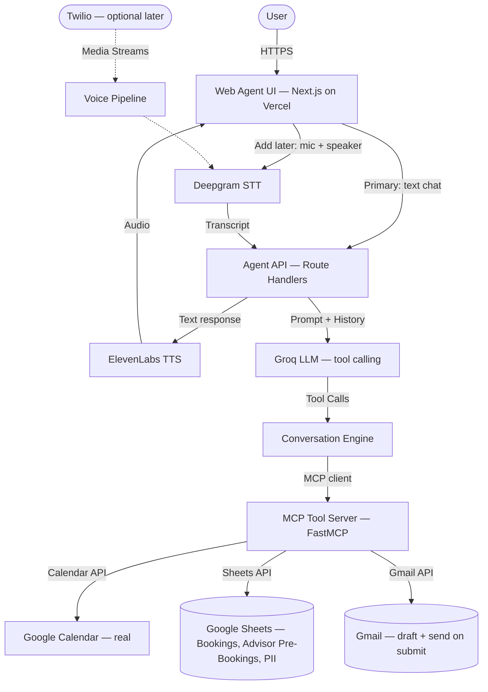
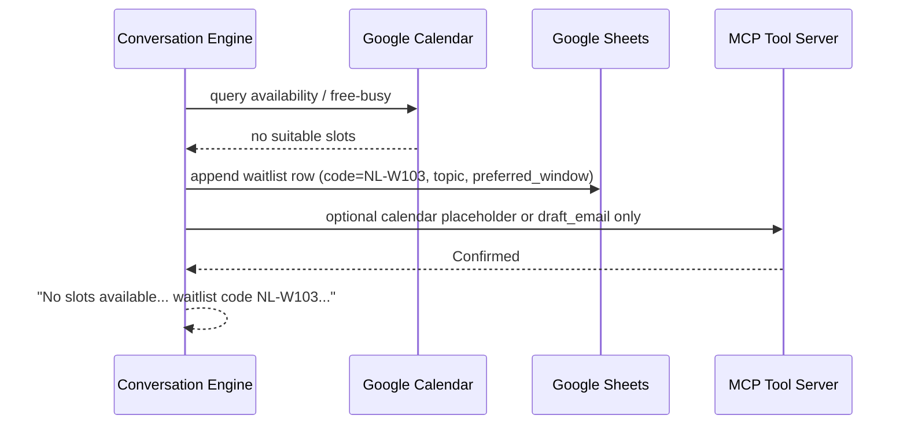
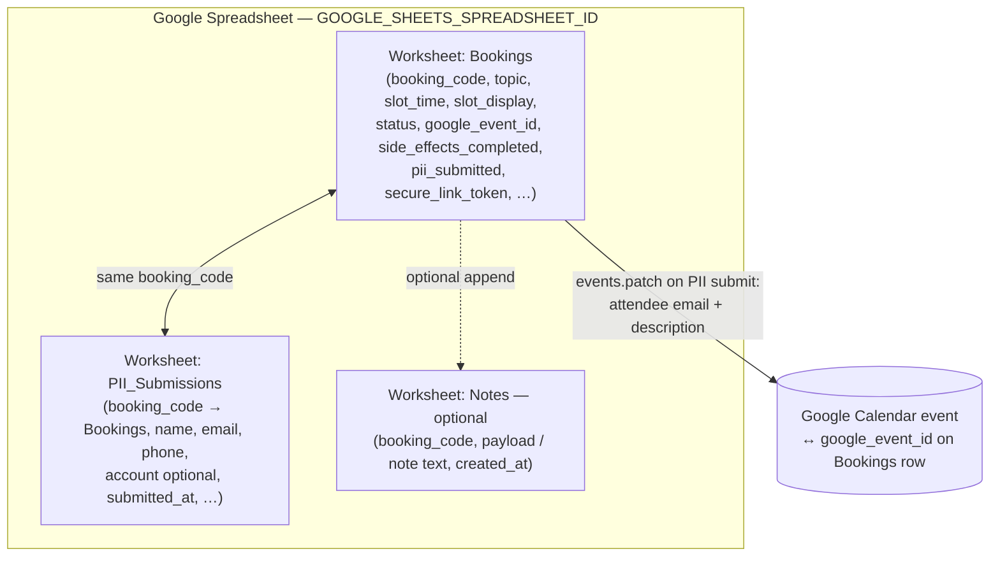
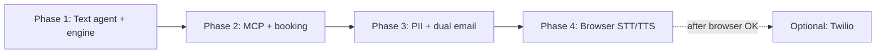

# Voice Agent: Advisor Appointment Scheduler — Architecture

> **Companion document:** [low-level-architecture.md](./low-level-architecture.md) contains the full implementation specification — code-level details, schemas, file structures, environment variables, deploy procedures, and rollback plans. Both documents share the same identifiers (component names, TC-IDs, EVAL-IDs, phase numbers) and must stay in sync. See the **Document Sync Protocol** in `low-level-architecture.md` for the rules governing changes across both files. **User stories & E2E flows:** [userstories.md](./userstories.md). **Environment variables:** a **single** template for all phases lives at **repository root** [`.env.example`](../.env.example) — copy to `.env` locally (gitignored); set real values in **Vercel**, not in GitHub. **LLM:** **Groq** ([OpenAI-compatible API](https://console.groq.com/docs/openai)) — Chat Completions + **tool calling** via the official **`openai`** npm client with `baseURL: https://api.groq.com/openai/v1`, **`GROQ_API_KEY`**, and **`GROQ_MODEL`** (see [Groq models](https://console.groq.com/docs/models)). **Google Calendar / Sheets / Gmail (booking + PII path):** **MCP only** in Next.js — **Gmail** supports **OAuth 2.0** (personal `@gmail.com`, refresh token in env) or **Google Workspace** domain-wide **delegation** (service account + `GMAIL_DELEGATED_USER`); see **§12c**. Implement the **MCP tool server with [FastMCP](https://gofastmcp.com/getting-started/welcome)** (Python) in **Backend Phase 2** (MCP); Next stays an **MCP client** only. The repo may still ship a **TypeScript stdio reference** ([`phase-2-scheduling-core/mcp/advisor-mcp-server.ts`](../phase-2-scheduling-core/mcp/advisor-mcp-server.ts)) until FastMCP parity; treat FastMCP as the **target** for new MCP work per [low-level-architecture.md](./low-level-architecture.md).

## 1. Context & Problem Statement

Users seeking human advisor consultations currently navigate manual booking flows — web forms, email threads, or hold queues — that average 10+ minutes and frequently drop off before completion. This voice agent replaces that friction with a short session that collects the consultation topic and time preference, offers **two real slots from Google Calendar** (no mock calendar), confirms the booking with a unique code, and triggers downstream **Google Calendar events** (tentative hold), internal notes, and **advisor email drafts** via MCP. **Initial implementation does not include Twilio:** the **primary UI is a browser-based agent**—first **text chat** (validate the agent end-to-end), then **microphone + speaker** (STT/TTS) on the same page—so you can prove the agent before any phone integration. **Twilio (PSTN) is a later, optional ingress** to the same pipeline. **Post-call PII collection and confirmation email are in scope:** after the agent session, the user completes **PII in a secondary UI**; on submit, the system **emails the user** booking details, **auto-sends (finalizes) advisor notification** at the same time, and shows an **on-screen success notification**. **Before PII submit**, the agent session UI shows **only a copyable booking ID** (no manual “send” or “notify advisor” control on that screen). **Hosting:** Next.js **frontend and backend on Vercel**; **no custom domain** required (`*.vercel.app` is fine). **Implementation order (time):** **① Text agent** → **② MCP** (real booking on text) → **③ Post-call PII** (still text-first UI) → **④ Browser voice** (mic + STT + TTS on the **same** page and engine). **Do not** build voice before text, MCP, and PII are acceptable on the text path—voice is **last**, additive. See **§14** and [low-level-architecture.md](./low-level-architecture.md).

**What “text first, then voice” means:** You **prove the full product loop in plain text** (`POST /api/agent/message`)—intents, guardrails, **Groq** LLM tool calls, **MCP** scheduling/confirm, and **post-call PII submit**—**without** Deepgram or ElevenLabs. Only then do you **add voice**: microphone → STT → **same** engine → TTS. Voice is an **additive layer**, not a parallel rewrite.

### How this document, low-level-architecture.md, and phase folders line up

| Artifact | Use it for |
|----------|------------|
| **architecture.md** (this file) | Milestones, ADRs, §7 data/worksheets, §8 API surface, §12–14 deployment. **§14 phase numbers (1–4) = implementation sequence** (text → MCP → PII → voice). |
| **low-level-architecture.md** | Concrete **files**, **routes**, **`.env.example`** keys, Sheets/Gmail/Calendar behavior, **FastMCP** MCP server spec, and per-phase implementation detail. |
| **`phase-*` folders** | Per-phase **README**, **tests.md**, **evals.md**. **`phase-1-text-agent/`** holds Phase 1 **documentation** only; the Next.js app (`app/`, `lib/`) lives at **repo root**. Active code packages: `phase-2-scheduling-core/`, `phase-3-post-call-pii/`. |

#### Implementation phase ↔ folder name

**§14 and headings use Phase 1–4 in strict build order:** text → MCP → PII → voice. Repo **folder names** still use legacy numbering (`phase-2-*`).

| Phase (§14 order) | What it is | Repo folder (current name) |
|-------------------|------------|------------------------------|
| **1** | Text agent + Conversation Engine + **Groq** LLM | Repo root (`app/`, `lib/`, `package.json`); Phase 1 **docs** in [`phase-1-text-agent/`](../phase-1-text-agent/) |
| **2** | MCP: Calendar + Sheets + Gmail (FastMCP; Next = MCP client only) | [`phase-2-scheduling-core/`](../phase-2-scheduling-core/) (`mcp/`, `mcp-client/`, `src/`) + re-exports in `lib/mcp/` at repo root |
| **3** | Post-call PII UI + submit via MCP | [`phase-3-post-call-pii/`](../phase-3-post-call-pii/) |
| **4** | Browser STT/TTS (same page + engine) | Future — `lib/voice/`, `app/api/agent/stream/` |

**Practical rule:** Plan with **architecture.md**; implement with **low-level-architecture.md**. **TC-/EVAL-IDs** in older files may still say “phase 3/4” for MCP/PII — align new tests to **§14** numbering above when you refresh the matrix.

## 2. Goals & Non-Goals

### Goals

- **G1:** A caller books a tentative advisor slot in under 2 minutes with ≤ 3 conversation turns after topic selection.
- **G2:** The agent correctly classifies all 5 intents (book, reschedule, cancel, what-to-prepare, check-availability) with ≥ 92% accuracy on the eval set.
- **G3:** Every confirmed booking triggers exactly 3 MCP side-effects: **Google Calendar** event (hold), notes entry, and email draft — with zero missed writes.
- **G4:** The **live agent** (text/voice) does **not** collect or store PII; it refuses investment advice and follows compliance copy; if a user volunteers PII in chat/voice, redirect with a generic “do not share personal details here” message. **Post-call:** PII is collected in the **designated secondary UI**; on successful submit, **user confirmation email** and **advisor notification email** are sent (see ADRs).
- **G5:** A compliance disclaimer appears in the **first assistant turn** (text chat) or within the first **10 seconds** of voice playback once STT/TTS is enabled.
- **G6:** Voice round-trip latency (user silence → agent speech start) stays under 1.5 seconds at p95.

### Non-Goals

- **NG1:** The agent does not provide investment advice, fund recommendations, or market commentary. It refuses and offers educational links.
- **NG2:** No authentication or account lookup during the session — the user is anonymous aside from the booking record (topic, slot, code).
- **NG3:** No PII collection **inside** the conversational agent turn; PII is **only** accepted via the **post-call** flow (encrypted storage per low-level spec), not in chat/voice.
- **NG4:** No multi-language support. English only for all phases.
- **NG5:** No outbound calling. The agent handles inbound calls only.

## 3. Architecture Overview



**Happy path (initial implementation — browser only, no Twilio):** The user opens the **Web Agent UI** on Vercel. **Implement in phase order:** **Phase 1** text-only → **Phase 2** MCP booking → **Phase 3** post-call PII → **Phase 4** mic + Deepgram + ElevenLabs on the same page. **UX flow** once built: user may type or speak into the **same** engine; on confirmation, **MCP** (FastMCP server) creates **Calendar** hold, **Sheets** rows, **Gmail draft** (**no** send from session UI). Session UI shows **copyable booking ID** only; **PII submit** triggers user + advisor email via MCP. **Twilio** is optional **later**.

**System boundary:** This architecture covers the **browser** agent (text then voice), **real** Google Calendar integration, **Google Sheets** as the durable store (bookings + PII rows), notes + Gmail **drafts** during the session and **post-PII-submit sends** (user + advisor). **Twilio telephony** is optional and deferred.

## 4. Component Breakdown

#### Web Agent UI (Primary)
**Responsibility:** Hosts the agent session: **Step 1** text chat; **Step 2** **voice** (mic, playback) on the same page—**no Twilio**. Homepage (`/`) redirects to `/agent` — no separate landing page. After a **confirmed** booking, a banner with the booking code and **"Submit contact details"** button appears (PII modal **does not auto-open**). The user clicks the button when ready; the modal collects PII (booking ID pre-filled, read-only); the chat thread stays **inactive** until the user closes the dialog. On successful PII submit, a "Thank you" screen shows email-sent details with a **"Back to chat"** button. When the user ends the session ("goodbye", "done", "exit"), a thank-you message appears with a **"New conversation"** button. **No** manual "send test" or ad-hoc advisor controls in-session. **One booking per session** — duplicate `confirm_booking` calls are blocked server-side.
**Scheduling behavior:** `offer_slots` returns **two example** free windows when the user has **not** narrowed a time-of-day (`time_preference` **`any`** scans roughly 09:00–22:00 IST that day). The user may **instead** name another time the same day; `confirm_booking` accepts **`start_iso` / `end_iso`** for that window after a **free/busy** check (not limited to the two listed slots). MCP **`confirm_booking`** validates the interval is free before writing; **`side_effects_completed`** treats Gmail draft **failure** separately from success (draft id string).
**Technology:** Next.js 14 (App Router) on **Vercel** — same project as the Agent API (monolith). No custom domain required; default `*.vercel.app` is fine.
**Interfaces:** `POST /api/agent/message` (text; response may include `bookingCode`, `secureLinkToken`, `slotDisplay`, `bookingTopic` for the modal); WebSocket or chunked audio for voice (see low-level doc). Standalone PII page `/booking/[code]` remains available for deep links.
**Scaling strategy:** Vercel Edge + serverless/Node runtime; voice WebSockets may require **Node runtime** (not Edge) for the streaming route — see low-level doc.
**Owner / repo:** `app/` within the Next.js project

#### Post-call PII UI (Secondary — required)
**Responsibility:** After the agent issues a booking code + secure token, collects PII in a **modal on `/agent`** (primary) or the dedicated **`/booking/[code]`** page (same form component). On successful submit: **send user confirmation email**, **auto-send advisor notification** (finalize the advisor draft / send via Gmail API), and show **in-modal success copy** (email-sent lines mirror MCP flags). **Cancellation / other actions:** reuse the same pattern—blocking dialog + success summary—when those flows are wired (tooling TBD).
**Technology:** Same Next.js app on Vercel (`app/agent/page.tsx`, `app/booking/[code]`).
**Interfaces:** `POST /api/booking/{code}/submit`; in-app modal uses **callback** completion; standalone page redirects to confirmed.
**Owner / repo:** `app/booking/` + `app/api/booking/`

#### Agent API (Backend on Vercel)
**Responsibility:** Exposes HTTP/WebSocket endpoints the Web Agent UI uses. Invokes the Conversation Engine with **text** (Step 1) or **transcript** (Step 2). Same deployment unit as the UI (**Vercel** Route Handlers or a single Next.js server bundle).
**Technology:** Next.js Route Handlers (`app/api/...`) recommended so frontend + backend deploy together. Alternative: separate FastAPI only if you outgrow serverless limits.
**Interfaces:** REST/WS from Web Agent UI to Conversation Engine + LLM.
**Owner / repo:** `app/api/agent/`

#### Twilio Voice Gateway (Optional — after browser voice is validated)
**Responsibility:** When enabled, accepts inbound PSTN/WebRTC calls and streams audio into the **same** STT → Engine → TTS path used by the browser (or a thin adapter that produces text transcripts). **Not part of the first implementation.**
**Technology:** Twilio Programmable Voice with Media Streams (WebSocket).
**Interfaces:** Webhook `/voice/incoming`; WebSocket `/voice/stream`.
**Scaling strategy:** Deferred until **browser** text + voice paths pass acceptance tests.
**Owner / repo:** `src/voice/twilio_handler.py` (optional module)

#### Voice Pipeline Service (Optional — Twilio path only)
**Responsibility:** Orchestrates audio-to-audio loop for **phone** ingress only: Twilio → STT → Engine → TTS → Twilio.
**Technology:** Same STT/TTS stack as browser path; may run as a long-lived process or separate service if Vercel limits apply.
**Owner / repo:** `src/voice/pipeline.py` (optional)

#### Deepgram STT
**Responsibility:** Converts streaming PCM audio into real-time text transcripts with word-level timestamps.
**Technology:** Deepgram Nova-2 streaming API. Chosen over Whisper for sub-300ms streaming latency (Whisper requires batch processing at 1–5s chunks). Chosen over Google STT for superior accuracy on Indian-accented English.
**Interfaces:** WebSocket streaming API; emits interim and final transcript events.
**Scaling strategy:** Managed SaaS — scales on Deepgram's infrastructure. Rate limit: 100 concurrent streams on Growth plan.
**Owner / repo:** `src/voice/stt.py`

#### ElevenLabs TTS
**Responsibility:** Converts agent response text into natural-sounding speech audio.
**Technology:** ElevenLabs Turbo v2.5 streaming API. Chosen over Azure TTS for more natural prosody; chosen over Google TTS for lower first-byte latency (~200ms).
**Configuration:** Voice profile is **not** hardcoded in source. Read **`ELEVENLABS_VOICE_ID`** from environment (Vercel env vars). You pick the voice once in the ElevenLabs UI, copy its ID into the variable, and change it per environment or rebrand without a code deploy.
**Interfaces:** REST streaming API; accepts text, returns chunked audio (MP3/PCM).
**Scaling strategy:** Managed SaaS. Rate limit: 100 concurrent requests on Scale plan.
**Owner / repo:** `src/voice/tts.py`

#### Conversation Engine
**Responsibility:** The brain of the agent. Manages dialog state, routes **user text or transcripts** to the LLM, enforces compliance guardrails (disclaimer, no PII storage, no-advice), parses LLM tool calls, orchestrates MCP execution, and produces the final response text.
**Technology:** **Groq** via the [OpenAI-compatible HTTP API](https://console.groq.com/docs/openai) with **tool/function calling** (`openai` package in Node, `baseURL` set to Groq — see low-level doc). State is held in-memory per **session** (short-lived).
**Interfaces:** Called by the Agent API with **text** (Step 1) or **transcript** (Step 2). Twilio path passes the same transcript shape.
**Scaling strategy:** Stateful per session but short-lived.
**Owner / repo:** `src/agent/engine.py`, `src/agent/prompts.py`, `src/agent/state.py` (or TypeScript equivalents under `lib/agent/`)

#### Groq LLM (OpenAI-compatible)
**Responsibility:** Intent classification, dialog response generation, and MCP tool call decisions based on conversation context and system prompt.
**Technology:** **Groq-hosted models** (e.g. Llama 3.3) via **`POST /v1/chat/completions`** with **tools** / function calling — same logical tools as in `lib/agent/llmTools.ts` (`offer_slots`, `confirm_booking`; intent is inferred in prose, not a separate tool). **`GROQ_MODEL`** and **`GROQ_API_KEY`** in env (see [`.env.example`](../.env.example)).
**Interfaces:** OpenAI SDK pointed at Groq `baseURL`; assistant messages may include `tool_calls`; results returned as `role: tool` follow-ups until the model emits final user-facing text.
**Scaling strategy:** Managed API — Groq rate limits; exponential backoff on 429 (`LLM_MAX_RETRIES`). Target: low latency suitable for conversational turns.
**Owner / repo:** `lib/agent/llm.ts`, `lib/agent/llmTools.ts`

#### MCP Tool Server
**Responsibility:** Executes side-effects triggered by the LLM's tool calls: **Google Calendar** events, notes entries, and **email drafts** (and later **send** when invoked from the UI button).
**Technology:** **MCP-compliant tool server** built with **[FastMCP](https://gofastmcp.com/getting-started/welcome)** — the standard Pythonic way to declare MCP tools, validation, and protocol lifecycle ([Welcome to FastMCP](https://gofastmcp.com/getting-started/welcome); see also [Model Context Protocol](https://modelcontextprotocol.io/)). The Next.js app may consume this server via MCP **client** transport (stdio, HTTP, or hosted) as defined in low-level-architecture.md, or a thin in-process adapter for simpler Vercel deploys. Each tool uses **idempotency keys** (booking_code) to prevent duplicate writes on retries.
**Interfaces:** Consumed by the Conversation Engine. Writes to **Google Calendar API**, **Google Sheets** (booking rows + optional notes metadata), and **Gmail API** (**draft** during session; **`messages.send`** only from the post-call submit handler — see ADR).
**Scaling strategy:** Stateless handlers.
**Owner / repo:** MCP server + Google adapters under [`phase-2-scheduling-core/`](../phase-2-scheduling-core/) (`mcp/advisor-mcp-server.ts`, `src/`); optional Python bridge in `fastmcp_server/`. Next.js **MCP client** source: [`phase-2-scheduling-core/mcp-client/`](../phase-2-scheduling-core/mcp-client/) (re-exported from [`lib/mcp/`](../lib/mcp/)).

#### Google Calendar Integration
**Responsibility:** **Real** availability and holds — no mock. Lists free/busy or available slots in the **configured advisor calendar**, creates **tentative events** (e.g., “Advisor Q&A — {Topic} — {Code}”) in IST.
**Technology:** **Google Calendar API**. Default auth: **service account** with calendar shared to the service account email, plus `GOOGLE_CALENDAR_ID` env var. Alternative: OAuth — listed in Open Questions if you need per-advisor calendars.
**Interfaces:** `get_available_slots(...)`, `create_calendar_event(...)`, `release_hold(...)` as implemented in `src/services/google_calendar.py`.
**Scaling strategy:** API quotas (Google default limits); cache short TTL for free/busy if needed.
**Owner / repo:** `src/services/google_calendar.py`

#### Booking & PII store (Google Sheets)
**Responsibility:** Persists booking rows, **Google event IDs**, waitlist rows, booking codes, optional **Gmail draft ids**, and **PII** rows (same workbook, separate tab) linked by **`booking_code`**. See **§7**.
**Technology:** **Google Sheets API** — workbook id **`GOOGLE_SHEETS_SPREADSHEET_ID`**; multiple **worksheets** (e.g. **Bookings**, **PII_Submissions**). Service account with **Editor** on the file.
**Interfaces:** Accessed from Route Handlers and MCP tools via `lib/services/google_sheets.ts` (or equivalent).
**Scaling strategy:** Sheets **read/write quotas** per Google Cloud project — batch updates where possible; idempotent retries on `booking_code`.
**Owner / repo:** `lib/services/google_sheets.ts` (+ env-driven tab names)

## 5. Data Flow

### 5a. Happy Path: Book New Appointment (Web — text or voice)

```mermaid
sequenceDiagram
    participant U as User
    participant UI as Web Agent UI
    participant API as Agent API
    participant STT as Deepgram STT
    participant CE as Conversation Engine
    participant LLM as Groq LLM
    participant TTS as ElevenLabs TTS
    participant MCP as MCP Tool Server
    participant GCal as Google Calendar
    participant Sh as Google Sheets

    Note over U,API: Step 1 — text only (validate engine before STT/TTS)
    U->>UI: Types message
    UI->>API: POST /api/agent/message
    API->>CE: user text
    CE->>LLM: system prompt + history
    LLM-->>CE: reply text + optional tools
    CE-->>API: assistant text
    API-->>UI: JSON messages

    Note over U,TTS: Step 2 — browser voice (same UI, mic on; Twilio not used)
    U->>UI: Speaks
    UI->>STT: audio stream / chunks
    STT-->>API: transcript
    API->>CE: transcript
    CE->>LLM: ...
    CE-->>API: assistant text
    API->>TTS: synthesize
    TTS-->>UI: audio playback

    Note over CE,Sh: Slot offer + confirm (either modality)
    CE->>LLM: tool offer_slots
    CE->>GCal: free/busy or list events → derive 2 slots (IST)
    GCal-->>CE: Slot A, Slot B
    CE->>LLM: slot text for user
    CE->>LLM: tool confirm_booking
    CE->>Sh: append Bookings row + booking_code
    CE->>MCP: create_calendar_event + append_notes + draft_email
    MCP->>GCal: insert event
    MCP-->>CE: ok

    Note over UI,API: After session — copyable ID only on agent UI
    UI->>UI: User copies booking ID; opens post-call PII flow
    UI->>API: POST /api/booking/:code/submit
    API->>Sh: append PII row; update Bookings (pii_submitted)
    API->>GCal: patch event — attendee + description
    API->>MCP: send_user_confirmation_email + send_advisor_notification
    API-->>UI: 201 + in-app notification
```

**Latency targets (voice path):** STT < 300ms after speech end (p95). LLM < 800ms p95. TTS first byte < 200ms. Round-trip < 1.5s p95. **Text path** is dominated by LLM latency.

**Failure cascade points:**
- STT failure → Conversation Engine receives no transcript → agent asks caller to repeat (up to 2 retries, then graceful exit).
- LLM timeout (> 3s) → Conversation Engine returns a canned "one moment please" filler while retrying once.
- MCP write failure → Booking row in **Sheets** has `side_effects_completed=false`; a background reconciliation job retries within 60 seconds.

### 5b. Waitlist Path (No Matching Slots)



## 6. Key Design Decisions (ADRs)

#### Decision: Groq LLM with tool calling instead of a custom intent classifier

**Status:** Accepted (revised 2026-04)

**Context:** The agent must classify 5 intents and manage multi-turn dialog with context-dependent slot filling. A custom NLU model (Rasa, Dialogflow) would require training data collection and ongoing model maintenance. The dialog complexity is moderate — 5 intents, 3 slot types, strict guardrails.

**Decision:** Use **Groq** ([OpenAI-compatible chat completions](https://console.groq.com/docs/openai)) with **function/tool declarations** for all tool interactions. Intent classification, slot extraction, and response generation happen in a **single** model turn per user message (with internal tool round-trips as needed).

**Alternatives Considered:**

| Option | Why rejected |
|--------|--------------|
| Rasa NLU + custom dialog manager | Requires 500+ training examples per intent, separate hosting, and ongoing retraining. Over-engineered for 5 intents. |
| Dialogflow CX | Flow-based design is rigid for edge cases; less flexible than LLM + tools for MCP orchestration. |
| Google Gemini (GenAI API) | Valid option; **v1 default in this repo is Groq** for generous free-tier throughput and OpenAI-compatible tooling. |

**Consequences:**
- Prompt engineering replaces model training — faster iteration, no ML pipeline
- Per-call cost and latency depend on **Groq** model choice (`GROQ_MODEL`) and account limits — monitor in [Groq Console](https://console.groq.com/)
- Latency / availability — mitigated with `LLM_TIMEOUT_MS`, 429 backoff (`LLM_MAX_RETRIES`), and user-facing fallbacks

---

#### Decision: No PII in the live agent; PII only in post-call flow

**Status:** Accepted (revised 2026-04)

**Context:** PII requires encryption at rest, retention policy, and a controlled channel. The conversational agent must not store PII from voice/text turns.

**Decision:** **Booking metadata only** in the agent path (topic, slot, code, Google event id, advisor draft id). **No** PII in chat/voice transcripts for storage; guardrails redirect volunteers. **Post-call:** `pii_submissions` table + **secondary UI** after the session; on submit → **user email** + **advisor auto-send** + **in-app notification** (see email ADR).

**Alternatives Considered:**

| Option | Why not |
|--------|--------|
| Collect PII in the agent turn | Compliance and accidental logging risk |

**Consequences:**
- **Phase 2 (MCP):** Advisor email exists as **Gmail draft** at booking (for inspection in Gmail during development), alongside Calendar + Sheets side-effects **via MCP tools only**.
- **Phase 3 (PII):** PII submit **finalizes** outreach: **user** + **advisor** both receive sends at submit time.

---

#### Decision: Used Deepgram Nova-2 for STT instead of OpenAI Whisper

**Status:** Accepted

**Context:** The voice agent needs real-time streaming transcription with sub-300ms latency. The STT must handle Indian-accented English accurately since the target user base operates in IST timezone and interacts with Indian financial advisors.

**Decision:** Deepgram Nova-2 streaming API for all speech-to-text processing.

**Alternatives Considered:**

| Option | Why rejected |
|--------|--------------|
| OpenAI Whisper (API) | No streaming support — requires batching audio in 1–5s chunks, adding 1–5s latency per turn. Unacceptable for conversational voice UX. |
| OpenAI Whisper (self-hosted) | Streaming possible with custom chunking, but requires GPU infrastructure, adds operational burden, and latency is still 500ms+ per chunk. |
| Google Cloud STT | Streaming supported, but accuracy on Indian English is 4–6% worse than Deepgram Nova-2 in internal benchmarks. |
| Azure Speech-to-Text | Comparable accuracy but higher first-byte latency (~400ms vs ~200ms for Deepgram). |

**Consequences:**
- Sub-300ms streaming latency enables natural conversation pacing
- Vendor dependency on Deepgram — mitigated by abstracting STT behind an interface (`src/voice/stt.py`)
- Cost: ~$0.0043/min (Growth plan) — ~$0.02 per 5-minute call

---

#### Decision: Used Model Context Protocol (MCP) for tool execution instead of direct service calls

**Status:** Accepted

**Context:** The LLM must trigger three distinct side-effects on booking confirmation: calendar hold, notes append, and email draft. These could be called directly from the Conversation Engine, but the problem statement specifies MCP as the integration layer.

**Decision:** Implement an MCP-compliant tool server that exposes calendar, notes, and email as discrete tools. **Build the server with [FastMCP](https://gofastmcp.com/getting-started/welcome)** (Python): declare tools as functions, get schema and validation automatically, and run a standards-compliant MCP server ([Welcome to FastMCP](https://gofastmcp.com/getting-started/welcome)). The Conversation Engine maps **LLM tool calls** (Groq / OpenAI-format) to MCP tool invocations (direct client or bridge — see low-level doc).

**Alternatives Considered:**

| Option | Why rejected |
|--------|--------------|
| Direct service calls from Conversation Engine | Tightly couples the engine to each service's API; no standardized retry/idempotency layer; doesn't satisfy the MCP requirement. |
| LangChain tool framework | Adds a heavy abstraction layer with frequent breaking changes; MCP + FastMCP is purpose-built for this use case. |

**Consequences:**
- Clean separation between LLM reasoning and side-effect execution
- Idempotency keys at the MCP layer prevent duplicate writes on LLM retries
- FastMCP server is independently testable — each tool has its own test suite
- Additional infrastructure component to deploy and monitor (Python MCP process or sidecar unless in-process adapter is used)

---

#### Decision: Google Calendar API for real scheduling (no mock calendar)

**Status:** Accepted

**Context:** Mock calendars drift from real advisor availability and waste validation time.

**Decision:** **Google Calendar API** is in scope for v1. Default pattern: **service account** + **shared calendar ID** (`GOOGLE_CALENDAR_ID`) with domain-wide or manual sharing of the calendar to the service account. Slots are derived from **free/busy** or event search with **IST** display rules.

**Alternatives Considered:**

| Option | When to use |
|--------|-------------|
| Per-advisor OAuth | If each advisor has their own calendar — see Open Questions |
| Outlook / Microsoft Graph | If stack is Microsoft-first — not in v1 unless requested |

**Consequences:**
- Need Google Cloud project, Calendar API enabled, credentials in Vercel env
- Quota and rate limits apply; cache aggressively for read paths if needed

---

#### Decision: Email draft at booking; dual auto-send on post-call PII submit

**Status:** Accepted (revised 2026-04)

**Context:** Advisor drafts at booking time support review in Gmail during development. The **agent session UI** does not expose send controls — **only copyable booking ID**. Product requires **both** end-user confirmation and **advisor notification** when PII is submitted.

**Decision:** On booking confirmation, MCP creates an **advisor-facing Gmail draft** only (inbox **`ADVISOR_INBOX_EMAIL`**). **No** email send from the agent session screen. **After PII submit** via `POST /api/booking/{code}/submit`: (1) persist PII (Sheets row linked by **`booking_code`**); (2) **patch Google Calendar** (attendee = user email + details); (3) **send user** confirmation (booking + static **`ADVISOR_PUBLIC_DETAILS`**); (4) **send advisor** at **`ADVISOR_INBOX_EMAIL`** (booking + user fields; may replace/supersede draft — idempotent on `booking_code`); (5) **in-app success notification**.

**Consequences:**
- Advisor draft in Gmail remains **unsent** until submit; after send, track state in Sheets and/or Gmail as needed (idempotent on `booking_code`).
- No “manual notify advisor” button on the session panel — only booking ID + copy until post-call submit (unless you change this later).

## 7. Data Model — worksheets & logical entities

**Persistence:** One **Google Spreadsheet** (`GOOGLE_SHEETS_SPREADSHEET_ID`) with **multiple worksheets** (tabs). **`booking_code`** is the **business key** linking tabs and Calendar side-effects. The diagram below is the **physical** layout; the bullet list maps **legacy logical names** (from earlier SQL-shaped docs) to sheets.



**Logical → physical mapping (no loss of model):**

| Logical entity | Where it lives now |
|----------------|-------------------|
| **BOOKING** | **Bookings** tab — one row per booking / waitlist row |
| **CALENDAR_HOLD** | **Calendar API** event + **google_event_id** (+ slot times on **Bookings** row or derived from Calendar) |
| **NOTES_ENTRY** | **Notes** tab **or** a column on **Bookings** — keyed by `booking_code` |
| **EMAIL_DRAFT** | **Gmail** draft resource + optional **gmail_draft_id** column on **Bookings**; send state tracked in Sheets and/or Gmail |
| **PII_SUBMISSION** | **PII_Submissions** tab — one row per submit; link **`booking_code`** |

**Physical persistence (detail):** Implementation rows live in **Google Sheets** as above. On post-call **Submit**, **`events.patch`** uses **`google_event_id`** to add the **user’s email** as **attendee** and refresh **description** — see [low-level-architecture.md](./low-level-architecture.md).

**Scope:** Post-call PII lives on **`PII_Submissions`** (optionally encrypted at app layer before write); **no** conversational PII on the agent path. **Bookings** rows hold scheduling metadata and flags only.

**Data retention policy:**
- Booking records: retained 90 days after `slot_time`, then soft-deleted (status → `archived`) **in the sheet** or via ops process.
- Call/chat transcripts: **not** stored long-term; in-memory during session only unless you explicitly add logging later.
- Gmail drafts: retained until sent or 90 days, whichever is first.

**Sensitive field classification:**

| Field | Classification | Protection |
|-------|---------------|------------|
| `booking_code` | Internal identifier | Unguessable short code; rate-limit PII submit per code |
| Draft body / advisor copy | Internal / Confidential | Gmail + optional mirror in Sheets; **`ADVISOR_INBOX_EMAIL`** from env |
| PII columns or ciphertext | Highly sensitive | Restrict spreadsheet sharing; optional **AES-GCM** per field before write (`PII_ENCRYPTION_KEY`) |
| User voice | Transient | Browser → STT without persistent raw audio in v1 |

## 8. API Surface

**Design philosophy:** **Next.js on Vercel** exposes the **Agent API** (Route Handlers) to the **Web Agent UI**. The Conversation Engine + MCP may run in-process or as shared modules in the same deployment. **Twilio** webhooks are **optional** and added when you enable phone ingress.

**Protocol:** REST (JSON) for chat and actions; WebSocket or chunked upload for **browser** audio (exact shape in low-level doc); MCP or in-process tools for side-effects.

**Auth model:**
- **v1:** No end-user auth. Session id (cookie or header) for multi-turn chat optional.
- **Send email / destructive actions:** protect with a **server-side secret** or **session ownership** check so random clients cannot send arbitrary emails (e.g., only the session that created the booking can send, or admin token in env for testing).
- **Twilio** (when enabled): validate `X-Twilio-Signature`.
- **MCP Tool Server:** internal only unless split out (then mTLS).

**Rate limiting:**
- LLM and Google Calendar API: throttle per session / per IP on Vercel (Edge Config, Upstash, or middleware).
- **PII submit / dual email send:** strict rate limit per booking code and per IP.

**Key endpoints (illustrative — canonical list in low-level doc):**

| Endpoint | Method | Purpose |
|----------|--------|---------|
| `/api/agent/message` | POST | Step 1 — user text in, assistant text out |
| `/api/agent/audio` or `WS /api/agent/stream` | POST / WS | Step 2 — audio in, assistant audio/text out |
| `/api/booking/{code}/submit` | POST | Post-call PII submit → Sheets + Calendar patch + **user** confirmation email + **advisor** auto-send + in-app notification |
| `/api/health` | GET | Health check |
| `/voice/incoming` | POST | **Optional** — Twilio TwiML |
| `/voice/stream` | WebSocket | **Optional** — Twilio Media Streams |

**MCP Tools (registered in `phase-2-scheduling-core/mcp/advisor-mcp-server.ts`):**

| Tool Name | Description | When |
|-----------|-------------|------|
| `offer_slots` | Returns up to two free calendar windows (IST) for a day/topic; `time_preference "any"` scans 9–22 IST | User asks to book or check availability |
| `confirm_booking` | Calendar hold + Sheets row + Advisor Pre-Bookings + Gmail **draft** → booking code + secure token | User picks or specifies a slot |
| `cancel_booking` | Delete Calendar event, Sheets status → `cancelled`, Gmail draft, send cancel email if PII on file | User requests cancel (by booking code) |
| `reschedule_booking` | Delete old Calendar event, create new hold, update Sheets, Gmail draft, send email if PII on file | User requests reschedule (code + new slot) |
| `lookup_booking` | Read-only lookup by code → status, topic, slot, `pii_submitted` | Before cancel/reschedule to verify |
| `lookup_pii_booking` | Validate code + secure token for PII page | PII page load |
| `submit_pii_booking` | Encrypt PII → Sheets, mark `pii_submitted`, patch Calendar attendee, **send** user + advisor emails | User submits PII form |

**Email timing:** Gmail **drafts** are created on booking, cancel, or reschedule (for advisor review). Actual **sends** happen: (a) on PII submit (user confirmation + advisor notification for new bookings), or (b) immediately on cancel/reschedule if user email is already on file from a prior PII submit.

## 9. UI Architecture

**UI delivery milestones (UI-1–UI-4)** are listed under **§14** (*Delivery tracks*). This section describes stack, screens, and components.

The **primary** UI is the **Web Agent** page (`/agent`) with a **clean light-themed** layout: light sidebar, centered thread, rounded send button, avatar circles, white background. The homepage (`/`) redirects directly to `/agent` — no separate landing page. The chat stays **open for multiple actions** (book, cancel, reschedule, check, prepare) until the user explicitly ends (e.g. "goodbye", "done", "exit"). On end, a **"Thank you"** message appears with a **"New conversation"** button; the sidebar also has a **"New conversation"** button at all times. After a **confirmed** booking, the banner shows the booking code + **"Submit contact details"** button (PII form **does not auto-open**). PII modal opens **on demand**, and after successful submit shows a thank-you with email-sent details, then **"Back to chat"**. Chat input is disabled while the PII dialog is open. **One booking per session** — duplicate `confirm_booking` calls are blocked server-side; the user must start a new flow (via `offer_slots`) for a second booking. Standalone PII page (`/booking/[code]`) remains available for deep links.

#### 9a. UI Stack

| Choice | Value | Rationale |
|--------|-------|-----------|
| Framework | Next.js 14 (App Router) on **Vercel** | Single deploy for UI + Agent API; no custom domain required |
| State management | React state + optional Zustand for session | Chat history + voice state |
| Styling | Tailwind CSS 3 | Fast iteration |
| Voice (Phase B) | MediaRecorder / Web Audio + streaming to STT API | Browser-first; Twilio later |

#### 9b. Screen Inventory

| Screen / Route | Purpose | Primary data source | Auth required |
|----------------|---------|---------------------|---------------|
| `/` or `/agent` | **Main** — chat + later voice; disclaimer; booking flow | Agent API | No (v1) |
| Session panel | **Copyable booking ID** + session summary; link/CTA to post-call PII | Bookings row via API / Sheets | Session-scoped |
| `/booking/[code]` (example) | Post-call PII form + success state | Submit API | Session-scoped |

#### 9c. Component Architecture

```
app/
├── agent/
│   ├── page.tsx                 # Client — chat UI + voice controls
│   └── components/
│       ├── ChatThread.tsx
│       ├── MicButton.tsx        # Phase B
│       └── BookingIdPanel.tsx   # Copyable code + CTA to post-call PII
├── api/
│   └── agent/
│   └── booking/
```

**Error boundaries:** User-facing errors for LLM/Calendar failures; no PII in error messages.

#### 9d. UI–API Contract

- Text: `POST /api/agent/message` with `{ sessionId, text }`.
- Voice: see low-level (WebSocket or chunked POST).
- **PII submit:** `POST /api/booking/{code}/submit` — user + advisor emails + in-app notification.

#### 9e. UI Test Strategy

| Layer | Tool | Coverage target |
|-------|------|-----------------|
| Unit | Jest + RTL | Chat components |
| Integration | Playwright | Text booking → code → post-call PII → dual send (mocked in CI) |
| Voice E2E | Playwright + fake audio or manual | Phase B |

#### 9f. UI pages & client/server split (detailed)

| Area | Responsibility | Typical implementation |
|------|----------------|------------------------|
| **`/agent` (or `/`)** | Main shell: disclaimer placement, chat thread, optional voice controls | **Client Component** (`'use client'`) — mic permission, `MediaRecorder`, streaming state |
| **`ChatThread`** | Message list, scroll, loading/error states per turn | Client; calls `POST /api/agent/message` for text |
| **`MicButton` + playback** | STT stream lifecycle, ElevenLabs playback via Web Audio | Client only; no raw audio persisted |
| **`BookingIdPanel`** | Copy-to-clipboard, short session summary, CTA link to `/booking/[code]` | Client; reads booking code from last assistant payload or client state |
| **`/booking/[code]`** | Post-call PII form (name, email, phone, …) | Client form + **Server** wrapper optional for SEO/security; submit → `POST /api/booking/[code]/submit` |
| **Layouts** | Shared chrome, fonts, theme | `app/layout.tsx` (Server); globals + Tailwind |

**Session continuity:** Use a **session id** (cookie, header, or generated id in `sessionStorage` + passed on each request) so multi-turn text and voice share one `ConversationEngine` state on the server.

**Accessibility & UX:** Visible focus states, keyboard path for text-only users, mic permission error copy, non-blocking disclaimer.

#### 9g. UI on Vercel (deployment-specific)

| Topic | Practice |
|-------|----------|
| **Single project** | One Vercel project hosts **all** UI routes + **all** `app/api/*` Route Handlers — no separate “frontend deploy” vs “API deploy” unless you split repos later. |
| **Preview vs Production** | Every PR gets a **Preview URL** (`*.vercel.app`); use it for stakeholder demos of UI changes. Set **Preview** env vars (non-prod keys) in Vercel → Settings → Environment Variables. |
| **Public env** | Only **`NEXT_PUBLIC_*`** is exposed to the browser — never put secrets there. Agent API URLs can be relative (`/api/...`) so no public base URL is required. |
| **Regions** | Choose Vercel **region** close to users (e.g. `iad1`) for latency; **Groq** and Google APIs are called **server-side** from that region. |
| **Analytics** | Enable **Vercel Analytics** / Speed Insights on the agent and booking pages for LCP, CLS (see §10). |

## 10. Scalability & Performance

**Launch projections:**
- Concurrent **web sessions** (text + voice) — tune after first deploy.
- Bookings/day bounded by Google Calendar + LLM quotas.

**12-month projections:**
- 200–300 concurrent calls at peak.
- ~2,000 bookings/day.
- **Sheets:** row volume well within typical workspace limits at this scale; watch **Sheets API quota** if batch jobs spike.

**Bottleneck analysis:**

| Bottleneck | Threshold | Mitigation |
|------------|-----------|------------|
| Agent API (Vercel) | Serverless concurrency limits | Use streaming wisely; split heavy work to background if needed |
| Google Calendar API | Per-project quotas | Exponential backoff; cache reads |
| Groq API rate limits | Per-key limits | Backoff on 429 (`LLM_MAX_RETRIES`); monitor in [Groq Console](https://console.groq.com/) |
| Deepgram concurrent streams | 100 on Growth plan | Upgrade to Enterprise plan at 80 concurrent |
| Google Sheets API quota | Per-minute read/write limits | Batch updates; exponential backoff |

**Caching strategy:**
- Available slots: cached in-memory for 30 seconds (stale reads acceptable — holds are validated at confirmation time).
- LLM system prompt: cached in application memory (changes require deployment).
- No Redis or external cache — unnecessary at projected volume.

**Voice latency budget:**

| Component | Target p95 | Measured at |
|-----------|-----------|-------------|
| STT (speech end → transcript) | 300ms | Deepgram dashboard |
| LLM (prompt → response) | 800ms | Groq API latency / traces |
| TTS (text → first audio byte) | 200ms | ElevenLabs API latency |
| Network overhead (Twilio ↔ service) | 100ms | Internal instrumentation |
| **Total voice round-trip** | **< 1,500ms** | End-to-end measurement |

**Frontend performance:**
- Agent page LCP target: < 2s on Vercel preview URL.
- CLS target: minimal for chat layout.

## 11. Security & Compliance

**Authentication & Authorization:**
- **v1:** Anonymous web sessions; optional session cookie for multi-turn continuity.
- **PII submit / send email:** must not be callable by arbitrary clients without checks — bind to session, booking ownership, or server secret for demos.
- **MCP / Google:** service account JSON in **Vercel env** (never commit).

**Data classification & protection:**

| Data | Classification | Storage | Protection |
|------|---------------|---------|------------|
| Chat/voice content | Transient | In-memory per request | Do not log raw user text in prod without redaction |
| Booking code, topic, slot | Internal | **Google Sheets** — Bookings tab | Restrict sharing; service account + Editor on file |
| Email draft body | Confidential | Gmail draft + optional column in Sheets | Access only via API; **`ADVISOR_INBOX_EMAIL`** from env |
| PII at rest (Phase 3) | Highly sensitive | **PII_Submissions** tab (plaintext or ciphertext columns) | Optional **AES-256-GCM** via **`PII_ENCRYPTION_KEY`** before write; lock down workbook ACL |
| Gmail OAuth refresh token | Secret | **Vercel env** (`GMAIL_OAUTH_REFRESH_TOKEN`) + client id/secret | Personal `@gmail.com` path; rotate if leaked; never commit |

**Network boundary:**
- **Vercel** hosts the public HTTPS app + API routes.
- Google APIs called server-side only.

**Secrets management:**
- **Vercel Environment Variables:** **`GROQ_API_KEY`**, **`GROQ_MODEL`**, `DEEPGRAM_API_KEY`, `ELEVENLABS_API_KEY`, **`ELEVENLABS_VOICE_ID`**, **`GOOGLE_SHEETS_SPREADSHEET_ID`**, `GOOGLE_SERVICE_ACCOUNT_JSON`, `GOOGLE_CALENDAR_ID`, **Gmail (pick one path):** **`GMAIL_OAUTH_CLIENT_ID`**, **`GMAIL_OAUTH_CLIENT_SECRET`**, **`GMAIL_OAUTH_REFRESH_TOKEN`**, **`GMAIL_OAUTH_REDIRECT_URI`**, **`GMAIL_OAUTH_USER_EMAIL`** (personal Gmail), **or** **`GMAIL_DELEGATED_USER`** (Workspace delegation only), plus **`ADVISOR_INBOX_EMAIL`**, **`ADVISOR_PUBLIC_DETAILS`**, **`PII_ENCRYPTION_KEY`** (optional if encrypting PII columns), optional `TWILIO_*` later.

**Compliance requirements:**
- **Disclaimer:** Shown at session start (text or first voice turn).
- **No-advice guardrail:** Unchanged — LLM refusals + evals.
- **No PII in agent session:** Do not ask for or store PII in the conversational path; regex guard still blocks obvious PII in input. **Post-call** PII is the **only** collection channel (encrypted store).
- **Twilio (optional):** Disable account-level call recording for this app.

**Failure modes:**

| Failure | Impact | Mitigation |
|---------|--------|------------|
| LLM advice leakage | Compliance | Guardrails + output checks |
| Duplicate MCP writes | Duplicate events | Idempotency on `booking_code` |
| Google API quota | No slots / errors | Backoff + user message |

**Frontend-specific security:**
- CSP as appropriate for Tailwind + mic APIs.
- **No PII** in client storage.

## 12. Deployment & Infrastructure

**v1 hosting:** **Vercel** for **both** the **Next.js UI** (everything under `app/` that renders in the browser) and the **backend** (Route Handlers under `app/api/`). One **git push** deploys both. **No custom domain** required. **Durable data:** **Google Sheets** + **Google Calendar** + **Gmail** (not PostgreSQL in the default design — see §7).

### 12a. Frontend vs backend (same repo, same Vercel deployment)

| Layer | What it is | Deployed as |
|-------|------------|-------------|
| **Frontend** | React UI: `app/agent/*`, `app/booking/*`, layouts, `components/`, client state, Tailwind, mic/Web Audio | **Static + SSR/CSR** chunks from `next build`; served by Vercel Edge/CDN |
| **Backend** | **Route Handlers** `app/api/agent/*`, `app/api/booking/*`, `app/api/health/*` — **Groq** LLM, Sheets, Calendar, Gmail, orchestration | **Serverless Node functions** (per route or grouped); **must use Node runtime** where LLM / Google APIs require it — not Edge for those routes |
| **Optional MCP (FastMCP)** | Python MCP process | **Separate** process or container (not the Edge runtime): same Vercel project as **serverless** only if you run MCP in a **Node** bridge or external host; many teams run FastMCP as a small sidecar or call tools in-process — see low-level doc |

**Rule of thumb:** If it touches **secrets** or **long I/O** (LLM, Calendar, Gmail), implement it under **`app/api/...`** (server), not in client components.

### 12b. Application (Next.js monolith on Vercel)

| Property | Value |
|----------|-------|
| Hosting | **Vercel** — **one** project for UI + API |
| Build | `next build` (root of Next.js app) |
| Runtime | **Node.js** for API routes that call **Groq**, Google Sheets, Calendar, Gmail |
| Environments | **Preview** (per PR branch) → **Production** (main) |
| Secrets | **Vercel → Project → Settings → Environment Variables** — attach to Preview and/or Production (`GROQ_*`, `DEEPGRAM_*`, `ELEVENLABS_*`, `GOOGLE_*`, `GOOGLE_SHEETS_*`, `GMAIL_OAUTH_*` or `GMAIL_DELEGATED_USER`, `PII_ENCRYPTION_KEY`, `ADVISOR_*`); never commit |
| Domain | Default **`https://<project>.vercel.app`** — custom domain optional |

**CI/CD:**

```
PR opened → Vercel Preview (full UI + API)
→ lint / unit / Playwright against Preview URL
→ merge to main → Production deploy
```

**Rollback:** Vercel **Instant Rollback** to a prior deployment (UI + API together).

### 12c. Google Sheets, Calendar, Gmail (not on Vercel’s runtime)

| Service | Where it lives | Connection from Vercel |
|---------|----------------|-------------------------|
| **Google Sheets** (bookings + PII) | User-owned spreadsheet, shared to service account | `GOOGLE_SHEETS_SPREADSHEET_ID` + Sheets API from Route Handlers |
| **Groq LLM** | [Groq OpenAI-compatible API](https://console.groq.com/docs/openai) | Server-side only from Route Handlers |
| Google Calendar | Google Cloud project | **`GOOGLE_SERVICE_ACCOUNT_JSON`** in env; Calendar API enabled; calendar shared to service account |
| **Gmail** (drafts + `messages.send` on PII submit) | User’s mailbox | **Two supported modes** (MCP server in `phase-2-scheduling-core` picks one — OAuth first if fully configured): |

**Gmail — personal `@gmail.com` (OAuth 2.0)**

- Create an **OAuth 2.0 Client ID** (Desktop or Web) in Google Cloud Console, enable **Gmail API**, and register a **redirect URI** (e.g. `http://localhost:3005/oauth2/callback` for local token exchange).
- Run **`npm run gmail:oauth-token`** from the **repository root** (wraps `phase-2-scheduling-core`) after setting `GMAIL_OAUTH_CLIENT_ID`, `GMAIL_OAUTH_CLIENT_SECRET`, and matching `GMAIL_OAUTH_REDIRECT_URI` in `.env`. Paste the authorization code; copy the printed **`GMAIL_OAUTH_REFRESH_TOKEN`** into `.env` and Vercel.
- Set **`GMAIL_OAUTH_USER_EMAIL`** to the same Gmail address you used when consenting (this value is the **From:** line for drafts and sends).
- Leave **`GMAIL_DELEGATED_USER`** empty for this path. **Sheets and Calendar** still use the **service account** as today.

**Gmail — Google Workspace (service account + domain-wide delegation)**

- Workspace admin authorizes the service account for Gmail scopes; set **`GMAIL_DELEGATED_USER`** to the mailbox to impersonate (not the `*.iam.gserviceaccount.com` address).
- Leave **`GMAIL_OAUTH_*`** unset. **`GOOGLE_SERVICE_ACCOUNT_JSON`** supplies the key; JWT uses `subject` = `GMAIL_DELEGATED_USER`.

**Precedence:** If **`GMAIL_OAUTH_CLIENT_ID`**, **`GMAIL_OAUTH_CLIENT_SECRET`**, and **`GMAIL_OAUTH_REFRESH_TOKEN`** are all set, the MCP server uses **OAuth** and ignores Workspace delegation for Gmail.

### 12d. Optional: Twilio (telephony) — after web agent is validated

| Property | Value |
|----------|-------|
| When | Optional later phase |
| Webhooks | Point to routes on the **same** Vercel project (or dedicated relay if needed) |

**Coupling:** Single codebase; **Preview** and **Production** should use **separate** spreadsheets (or tabs) if you need data isolation — set different `GOOGLE_SHEETS_SPREADSHEET_ID` per Vercel environment.

### 12e. Vercel deployment playbook (step-by-step)

Use this for **first deploy** and **ongoing releases**. UI and backend ship together (one project).

1. **Repository:** Connect the Next.js app repo to **Vercel** (Import Project).
2. **Framework:** Select **Next.js**; root directory = app root; build = `next build`; output default.
3. **Runtime:** For routes using **Groq** / Google clients, set **Node.js** on those Route Handlers (not Edge) — see Next.js `export const runtime = 'nodejs'` where needed.
4. **Environments:** Configure **Production** (production branch, e.g. `main`) and **Preview** (all other branches or PRs).
5. **Environment variables:** In **Project → Settings → Environment Variables**, add secrets per [low-level registry](./low-level-architecture.md#complete-environment-variable-registry). Mark **Preview** vs **Production**; use a **non-prod** spreadsheet id for Preview if possible.
6. **First deploy:** Merge to main or deploy from CLI `vercel --prod`. Smoke-test `GET /api/health`.
7. **Preview QA:** Open the **Preview URL**; run text agent → (when ready) voice → booking → PII submit on **staging** calendar/sheet.
8. **Production promote:** Merge PR to production branch; Vercel builds automatically. Use **Instant Rollback** if a regression ships.
9. **Observability:** Enable Vercel logs; optional Sentry; monitor Google API quotas in Cloud Console.

**Related:** UI-specific practices — **§9g**; phased feature work — **§14**.

### 12f. GitHub repository, CI, and Vercel — dependencies and common pitfalls

**Intended flow:** Push application code to **GitHub** (or GitLab/Bitbucket) → connect the repo to **Vercel** → Vercel runs `next build` on each push/PR → **Preview** or **Production** deployment.

| Concern | What to do | Risk if skipped |
|--------|------------|-----------------|
| **Secrets** | Keep **only** [`.env.example`](../.env.example) in git. Real keys in **Vercel → Environment Variables** (and local `.env`, gitignored). | Keys in repo history; compliance failure |
| **`.gitignore`** | Ignore `.env`, `.env.local` | Accidental secret commit |
| **Node version** | Align `engines` in `package.json` with Vercel Node (LTS) | Build failures on Vercel |
| **Lockfile** | Commit **one** of `package-lock.json` / `pnpm-lock.yaml` / `yarn.lock` | Non-reproducible installs |
| **Google Cloud** | Enable **Sheets API**, **Calendar API**, **Gmail API** (as needed); share the **spreadsheet** (and Calendar) with the service account email; for personal Gmail add **OAuth consent screen** + OAuth client for **`GMAIL_OAUTH_*`** | 403 at runtime / Gmail auth errors |
| **Service account** | `GOOGLE_SERVICE_ACCOUNT_JSON` as one-line JSON or base64 in Vercel; no trailing newline issues | Auth errors |
| **Runtime** | Route Handlers calling Groq/Google must use **`nodejs`** runtime, not Edge | Edge bundle errors / missing APIs |
| **MCP (FastMCP) Python** | If MCP runs as a **separate** process, it needs its **own** host (Railway, Cloud Run, etc.) — Vercel alone does not run long-lived Python MCP unless containerized | Tool timeouts; bridge required |
| **Git integration** | Vercel needs permission to read the repo (GitHub App OAuth) | Failed deploys |
| **Environment parity** | Use a **staging** spreadsheet + test calendar for **Preview** env vars | Production data pollution |

**CI (optional):** GitHub Actions can run `lint`, `typecheck`, and `playwright` against a **Preview URL** after Vercel deploy — add secrets (`VERCEL_TOKEN`, etc.) only in GitHub **Actions secrets**, not in the codebase.

## 13. Observability

| Category | Tool | Details |
|----------|------|---------|
| App logs | Vercel / provider logs | Structured logs from Route Handlers; **no user PII** |
| Errors | Sentry (optional) | Client + server |
| Frontend | Vercel Analytics | Web Vitals |
| Google APIs | Google Cloud metrics / logs | Calendar API errors, quota |
| Voice (Phase 4) | Deepgram / ElevenLabs dashboards | STT/TTS latency |

**Key alerts:**

| Alert | Condition | Severity | Action |
|-------|-----------|----------|--------|
| MCP / Google write failure | Spike in 5xx on booking | P1 | Check logs; verify service account + calendar ID |
| LLM guardrail breach | Any advice in production logs | P0 | Block + fix prompt |

**Dashboards:** Start with Vercel + provider consoles; custom dashboards optional.

## 14. Implementation Phases

> **Authoritative sequence — Phase 1 → 2 → 3 → 4** (same order as §14 headings below): **Phase 1 — Text chat ↔ text out** — prove agent, intents, guardrails **without** audio. **Phase 2 — MCP** — scheduling + booking side-effects (FastMCP; Next = MCP client only; no `googleapis` in the app bundle for these paths). **Phase 3 — Post-call PII** + dual email + notification. **Phase 4 — Browser STT + TTS** on the same page and engine; **no Twilio**. **Twilio** stays optional until the browser path is validated.
>
> **Implementation details** (FastMCP layout, TypeScript reference server, env vars) live in [low-level-architecture.md](./low-level-architecture.md). **TC-/EVAL-** prefixes in older files may not match this numbering yet.

### Delivery tracks: backend, frontend & UI, and Vercel

Work is organized in **three parallel tracks**. **Backend phases 1–4** below follow **implementation sequence** (same as document order). **Vercel** steps are centralized in **§12e**.

| Track | What it covers | Doc pointers |
|-------|----------------|--------------|
| **Backend** | Route Handlers, Conversation Engine, **Groq** LLM, **MCP client → MCP server** (Calendar/Sheets/Gmail on booking path), submit handler | **§14** phases 1–4, [low-level](./low-level-architecture.md) |
| **Frontend & UI** | `app/agent`, `app/booking`, components, a11y, mic UX, forms, toasts | **§9**, table **UI-1–UI-4** below |
| **Vercel deployment** | Project link, envs, Preview vs Prod, rollback, GitHub integration pitfalls | **§12**, **§12e**, **§12f** |

#### Frontend & UI milestones (align with backend phases)

| UI milestone | User-visible outcome | Tied to backend phase |
|--------------|---------------------|------------------------|
| **UI-1** | Agent page: text chat, disclaimer, loading/error, session id | Phase 1 |
| **UI-2** | Same page: mic, STT/TTS playback, permission UX | Phase 4 |
| **UI-3** | Slot presentation, confirmation UX, **BookingIdPanel**, session end: copyable code + CTA | Phase 2 (MCP) |
| **UI-4** | `/booking/[code]` form, validation, success state, dual-send confirmation toast | Phase 3 (PII) |

**Note:** Twilio (phone) has **no** UI milestone in v1 — browser only until optional telephony.

### Text-first, then voice (explicit product meaning)

This is **not** two separate apps. **Phases 1–3** use **text only** until booking, MCP tools, and PII submit are validated—**no** Deepgram or ElevenLabs. **Phase 4** adds **mic + STT + TTS** on the **same** page and engine. Phase 4 (future) will add voice support in `lib/voice/` and `app/api/agent/stream/`.

### Phase map: frontend vs backend (what to build where)

All of this ships in **one Next.js app** on **one Vercel project** unless you explicitly split services. Use this table to plan work across UI and API.

| Arch. phase | Primary **frontend** work | Primary **backend** work | Vercel note |
|-------------|---------------------------|---------------------------|-------------|
| **1 — Text agent** | `app/agent` page: `ChatThread`, textarea, send button, disclaimer, loading states; session id in client | `app/api/agent/message`, Conversation Engine + **Groq**, prompts, guardrails; no audio routes yet | Deploy Preview URL; test full flow in browser without mic |
| **2 — MCP** | Slot chips/copy, **BookingIdPanel**, copyable booking code + CTA | Next **MCP client** (`lib/mcp/`) → **FastMCP** (or TS reference): Calendar, **Bookings** + **Advisor Pre-Bookings**, **Gmail draft** | [`phase-2-scheduling-core/`](../phase-2-scheduling-core/); `MCP_*` / `GOOGLE_*` env |
| **3 — Post-call PII** | `app/booking/[code]`, form validation, success toast | `POST .../submit` → **MCP** only for PII row, Calendar patch, dual email | [`phase-3-post-call-pii/`](../phase-3-post-call-pii/) |
| **4 — Browser voice** | `MicButton`, capture/stream audio, play TTS, permission UX | `app/api/agent/stream` (or chunked POST), Deepgram + ElevenLabs; same engine as text | **Node** runtime; future — `lib/voice/`, `app/api/agent/stream/` |

**Deployment:** Every row’s frontend + backend go out together via **`vercel deploy`** / Git integration — see **§12** and **§9g**.

### Backend — Phase 1 — Text Agent & Conversation Engine (chat ↔ chat)

**Goal:** **Text-only** Web Agent UI on Vercel: user types, assistant replies over `POST /api/agent/message`. The Conversation Engine runs with **full** intent classification, multi-turn dialog, compliance disclaimer on first turn, PII/no-advice guardrails — **no STT, no TTS, no Twilio**. This validates **LLM + tool wiring** before any voice complexity.
**Depends on:** None
**Exit criteria:** Text booking dialog through topic + time preference (slot tools may stub until **Phase 2** MCP); TC-1-xx–style cases for intents/guardrails pass on **text**; EVAL-1-01 / EVAL-1-02 on text transcripts (see [evals.md](../phase-1-text-agent/evals.md)).
**Estimated scope:** L
**Folder:** Repo root ([`app/`](../app/), [`lib/`](../lib/)); Phase 1 **outputs / tests / evals** — [`phase-1-text-agent/`](../phase-1-text-agent/)
**Implementation:** [low-level-architecture.md § Phase 1](./low-level-architecture.md#phase-1--text-agent--conversation-engine-browser-first)

### Backend — Phase 2 — MCP: Scheduling & booking side-effects (merged)

**Goal:** One **MCP tool server** (build with **[FastMCP](https://gofastmcp.com/getting-started/welcome)** — Python) owns **all** Google side-effects for the agent session through confirmation: **two real Calendar slots**, **tentative Calendar hold**, **Bookings** row, **Advisor Pre-Bookings** append, advisor **Gmail draft**, and **PII submit** tools (`submit_pii_booking`, etc.) — **IST** rules as documented. The **Next.js** app maps **LLM tool calls** to **MCP `tools/call`** only — **no `googleapis` in the Next bundle** for Calendar, Sheets, or Gmail on these paths. A **TypeScript stdio** server in-repo is a **reference bridge** until FastMCP is the single source of truth; see low-level doc.
**Depends on:** Phase 1
**Exit criteria:** Scheduling + MCP reliability tests pass against a **live** FastMCP (or reference TS) server + Google configuration; combined EVAL gates as scoped.
**Estimated scope:** L
**Folder:** [phase-2-scheduling-core/](../phase-2-scheduling-core/) — TS MCP server (`mcp/`), **Next MCP client** (`mcp-client/`), Google `src/`, optional `fastmcp_server/`; [lib/mcp/](../lib/mcp/) re-exports the client for `@/lib/mcp/*` imports.
**Implementation:** [low-level-architecture.md § Phase 2](./low-level-architecture.md#phase-2--mcp-scheduling--booking-side-effects-merged)

### Backend — Phase 3 — Post-call PII & user + advisor email

**Goal:** Secondary UI for PII after the agent session; on submit: **encrypted storage**, **user confirmation email**, **advisor notification auto-send** (finalize draft), **in-app notification**. **No custom domain required** — Vercel URL is sufficient. **Sheets / Calendar patch / Gmail send** on this path must also follow the **MCP-only** rule (no duplicate direct Google clients in Route Handlers).
**Depends on:** Phase 2
**Exit criteria:** TC-5-xx (or renumbered PII tests) as applicable; PII encryption; dual-send idempotency; adversarial evals as scoped.
**Estimated scope:** L
**Folder:** [phase-3-post-call-pii/](../phase-3-post-call-pii/) — PII lib + UI components; Next routes under [app/booking/](../app/booking/) import from here.
**Implementation:** [low-level-architecture.md § Phase 3](./low-level-architecture.md#phase-3--post-call-pii--user--advisor-email)

### Backend — Phase 4 — Browser Voice Pipeline (STT + TTS, no Twilio)

**Goal:** Same page gains **microphone + speaker**; **Deepgram** streams transcripts into the **same** Conversation Engine path; **ElevenLabs** speaks replies. **Twilio is not used** — PSTN is deferred. Prove voice round-trip latency and disclaimer within first voice playback (G5).
**Depends on:** Phase 1 (engine); **recommended** after **Phases 2–3** are green on text.
**Exit criteria:** TC-1-01–style voice tests on **browser** audio; voice round-trip \< 2s p95 where measurable; STT/TTS integrated with existing engine.
**Estimated scope:** M
**Folder:** Future — `lib/voice/`, `app/api/agent/stream/` at repo root
**Implementation:** [low-level-architecture.md § Phase 4](./low-level-architecture.md#phase-4--browser-voice-no-twilio)

### Optional later — Twilio telephony

**Goal:** Inbound PSTN calls stream into the **same** STT → Engine → TTS stack (or transcript-equivalent).
**Depends on:** **Phase 4** (browser voice) validated
**Implementation:** [low-level-architecture.md § Optional — Twilio](./low-level-architecture.md#optional--twilio-telephony-later)

**Phase dependency diagram:**



**Phase Status Table:**

| Phase | Name | Status | Exit criteria | AI eval gate | Folder |
|-------|------|--------|---------------|--------------|--------|
| 1 | Text Agent & Conversation Engine | 🔲 Not started | Text-first TCs / intents / guardrails | EVAL-1-01 / EVAL-1-02 on **text** | Repo root (`app/`, `lib/`) + [`phase-1-text-agent/`](../phase-1-text-agent/) (docs) |
| 2 | **MCP** — scheduling + booking (FastMCP) | 🔲 Not started | MCP / Sheets / Calendar reliability | EVAL as scoped | [phase-2-scheduling-core/](../phase-2-scheduling-core/) (`mcp-client` + `lib/mcp` re-export) |
| 3 | Post-call PII & dual email | 🔲 Not started | TC-5-xx; dual send; encryption | EVAL as scoped | [phase-3-post-call-pii/](../phase-3-post-call-pii/) |
| 4 | Browser Voice STT/TTS | 🔲 Not started | Browser voice TCs; round-trip latency | Phase 4 (future) | Future — `lib/voice/`, `app/api/agent/stream/` |

Status legend: 🔲 Not started · 🔄 In progress · ✅ Complete · ⛔ Blocked

## 15. Open Questions

| Question | Owner | Target resolution |
|----------|-------|-------------------|
| Twilio number / region for IST users *(only if optional telephony is enabled)* | Platform | Before Twilio integration |

**Resolved:** ~~Post-call PII optional?~~ → **In scope (required).** ~~Advisor send on PII submit?~~ → **Auto-send advisor** at submit with user email. ~~Manual send on session UI?~~ → **No** — booking ID + copy only until post-call submit (unless you change later). ~~PII encryption KMS vs env?~~ → **Env-only AES** (`PII_ENCRYPTION_KEY`). ~~ElevenLabs voice ID hardcoded?~~ → **`ELEVENLABS_VOICE_ID`** env var (pick voice in ElevenLabs console). ~~Which Gmail inbox for advisor drafts?~~ → **`ADVISOR_INBOX_EMAIL`** env var — drafts are created/sent to that address; no separate “ops process” field in code (your team still decides who logs into that inbox).

**Parked:** ~~Mock calendar~~ → **Real Google Calendar only**. ~~Custom domain~~ → **Not required**; **Vercel `*.vercel.app`** is in scope.

## 16. References

- **Low-Level Architecture:** [low-level-architecture.md](./low-level-architecture.md) — implementation spec, code, schemas, env vars, deploy/rollback
- [Twilio Media Streams documentation](https://www.twilio.com/docs/voice/media-streams)
- [Deepgram Nova-2 streaming API](https://developers.deepgram.com/docs/getting-started-with-live-streaming-audio)
- [ElevenLabs streaming TTS API](https://elevenlabs.io/docs/api-reference/text-to-speech-stream)
- [Groq — Tool use / local tool calling](https://console.groq.com/docs/tool-use/local-tool-calling) (OpenAI-compatible tools; see `lib/agent/llmTools.ts`)
- [FastMCP — Welcome](https://gofastmcp.com/getting-started/welcome) (Python MCP server framework)
- [Model Context Protocol specification](https://modelcontextprotocol.io/)
- [Next.js 14 App Router documentation](https://nextjs.org/docs/app)
- Problem Statement: [Docs/Problemstatement.md](./Problemstatement.md)
- Project Description: [Docs/Description.md](./Description.md)
- User stories & E2E flows: [Docs/userstories.md](./userstories.md)
- Environment template (all phases): [`.env.example`](../.env.example)
