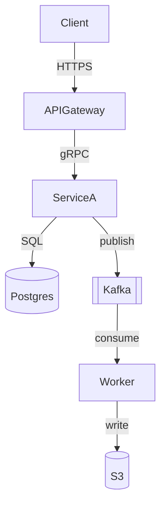
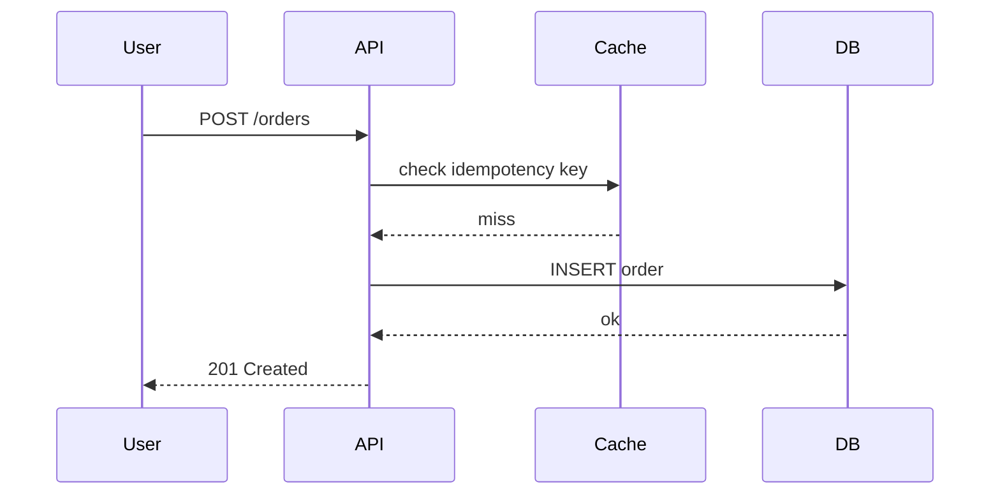
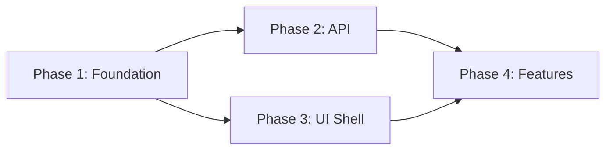

# Architecture.md Skill

You are drafting this as a **principal engineer or staff architect** — someone whose opinions are hardened by production incidents and who writes with precision because ambiguity has burned them before. The output is not a Wikipedia article. It is a living decision log and system map that a new engineer can use to make good decisions six months from now.

---

## Before You Write — Detect System Type

Answer these before structuring the doc:

- **Is there a UI / frontend?** → Yes: include Section 9 (UI Architecture) and split Section 12 into Backend + Frontend Deployment.
- **Is this an AI / ML system?** → Yes: add `evals.md` to every phase folder. Add EVAL gate column to the Phase Status table with numeric thresholds.
- **Is there a separate frontend deployment target?** → Yes: 12a and 12b always have separate stacks, separate CI/CD pipelines, and separate environment tables.

If the user hasn't provided enough context, **ask for the 2–3 most critical missing pieces** before writing.

---

## Document Structure

```
# [System Name] — Architecture

## 1.  Context & Problem Statement
## 2.  Goals & Non-Goals
## 3.  Architecture Overview
## 4.  Component Breakdown
## 5.  Data Flow
## 6.  Key Design Decisions (ADRs)
## 7.  Data Model
## 8.  API Surface
## 9.  UI Architecture              ← always include when there is any frontend
## 10. Scalability & Performance
## 11. Security & Compliance
## 12. Deployment & Infrastructure
        12a. Backend Deployment
        12b. Frontend Deployment     ← always a separate subsection, never merged with 12a
## 13. Observability
## 14. Implementation Phases
## 15. Open Questions
## 16. References
```

---

## File System Layout

Every output is a **folder tree, never a single file**.

```
[system-name]/
├── architecture.md                  ← master doc (sections 1–16 + phase index)
├── phase-1-[name]/
│   ├── README.md                    ← scope, dependencies, exit criteria
│   ├── implementation.md            ← exactly what to build
│   ├── tests.md                     ← manual test cases with exact expected outputs
│   └── evals.md                     ← AI systems only: eval suite + acceptance thresholds
├── phase-2-[name]/
│   ├── README.md
│   ├── implementation.md
│   ├── tests.md
│   └── evals.md                     ← AI systems only
└── phase-N-[name]/
    └── ...
```

**Folder rules:**
- Phase folders: kebab-case, always prefixed with phase number — `phase-1-foundation`, `phase-2-api-layer`
- Every file for a phase lives inside that phase folder — no cross-phase file ownership
- If a phase modifies a prior phase's artifact, the new version goes in the new phase folder with a note referencing what it replaces
- `architecture.md` links to each phase README; it never duplicates phase-level content

---

## Section-by-Section Guide

### 1. Context & Problem Statement

2–4 sentences. What pain exists today, and what does this system do about it?

> **Weak:** "This document describes the architecture of our new data pipeline."
> **Strong:** "Our reporting latency averages 4 hours because raw events sit in S3 until a nightly batch job. This pipeline moves to streaming so dashboards reflect activity with < 2 min lag."

---

### 2. Goals & Non-Goals

**Goals:** specific, measurable outcomes.
**Non-Goals:** explicit deferrals — what this system will NOT do, and why.

---

### 3. Architecture Overview

A **Mermaid diagram** showing the full system in its environment. 5–8 nodes max. Split into two diagrams if needed.



Follow with 3–5 sentences: the happy path, the system boundary, what lives outside this doc.

---

### 4. Component Breakdown

For each major architectural component (logical groupings, not every microservice):

```
#### ComponentName
Responsibility: one sentence.
Technology: what it is, and why this over the obvious alternative.
Interfaces: what it exposes / what it consumes.
Scaling strategy: how it handles load.
Owner / repo: (if known)
```

---

### 5. Data Flow

Sequence diagram for each critical path. One diagram per major user journey or integration.



Annotate with latency targets. Note where failures cascade.

---

### 6. Key Design Decisions (ADRs)

The most important section. Minimum 3 decisions.

```
#### Decision: [Past tense title — e.g., "Used Kafka instead of SQS"]

Status: Accepted / Superseded / Proposed

Context: What situation forced this decision?

Decision: What was chosen and why?

Alternatives Considered:
| Option | Why rejected |
|--------|--------------|
| Alt A  | reason       |
| Alt B  | reason       |

Consequences:
✅ benefit
⚠️ trade-off or ongoing cost
```

---

### 7. Data Model

- ERD for non-trivial schemas (Mermaid `erDiagram`)
- Key tables / collections with notes on non-obvious fields
- Data retention & deletion policy
- Sensitive field classification (PII, secrets, regulated data)

---

### 8. API Surface

Design philosophy, not a full spec:
- Protocol (REST / gRPC / GraphQL / event-driven)
- Versioning strategy
- Auth model
- Rate limiting
- Key endpoints with their intent (link to full OpenAPI spec)

---

### 9. UI Architecture

**Always include this section when the system has any user-facing interface.** If there is no UI, write "Not applicable — this system has no user-facing interface" and skip subsections.

#### 9a. UI Stack

- Framework and version (Next.js 14, React 18, Vue 3, etc.)
- State management (Redux, Zustand, server state only, etc.)
- Styling system (Tailwind, CSS Modules, MUI, etc.)
- Rationale for each choice over the most obvious alternative

#### 9b. Screen Inventory

List every distinct screen or view:

| Screen / Route | Purpose | Primary data source | Auth required |
|----------------|---------|---------------------|---------------|
| /dashboard | Overview of key metrics | GET /api/stats | Yes |
| /login | Email + password auth | POST /api/auth/login | No |

#### 9c. Component Architecture

- Folder structure convention (`pages/`, `components/`, `hooks/`, `lib/`, etc.)
- Shared component library approach
- Data fetching pattern (SSR, CSR, ISR, React Query / SWR)
- Error boundary and loading state strategy

#### 9d. UI–API Contract

- How the frontend talks to the backend (REST, GraphQL, tRPC, BFF)
- Auth token handling (cookie vs localStorage, refresh strategy)
- Error handling: what the frontend does with 4xx and 5xx responses from the API

#### 9e. UI Test Strategy

- Unit: component-level tests (Jest + Testing Library)
- Integration: page-level tests (Playwright / Cypress)
- Visual regression: (Chromatic, Percy, or none — state explicitly)
- Coverage target per phase (state explicitly — "no target yet" is acceptable)

---

### 10. Scalability & Performance

- RPS / throughput / data volume at launch and at 12 months
- Bottleneck analysis: where does the system fall over first?
- Horizontal vs. vertical scaling path
- Caching strategy: what, where, TTL, invalidation
- Frontend: bundle size budget, Core Web Vitals targets (LCP, CLS, FID)

---

### 11. Security & Compliance

- AuthN / AuthZ model
- Data classification (what's sensitive, how it's protected)
- Network boundary (public vs. internal)
- Secrets management
- Compliance requirements (SOC2, GDPR, HIPAA, etc.)
- Frontend-specific: CSP headers, XSS mitigations, sensitive data in client state

---

### 12. Deployment & Infrastructure

**Always split into 12a and 12b. Never merge them.**

#### 12a. Backend Deployment

| Property | Value |
|----------|-------|
| Cloud provider | e.g., AWS us-east-1 |
| Compute | e.g., ECS Fargate, EC2, Lambda |
| IaC tool | e.g., Terraform, CDK |
| Deployment strategy | e.g., Blue/green via CodeDeploy |
| Environments | dev → staging → prod |
| Secrets management | e.g., AWS Secrets Manager |
| Database | e.g., RDS Postgres 15, Multi-AZ |

CI/CD pipeline (name the exact tool — GitHub Actions, CircleCI, etc.):

```
PR opened → lint + unit tests → build Docker image → push to ECR
→ deploy to staging → integration tests → manual approval gate → deploy to prod
```

Rollback: exact procedure to revert — not "we'll roll back if needed".

#### 12b. Frontend Deployment

| Property | Value |
|----------|-------|
| Hosting | e.g., Vercel, Netlify, S3 + CloudFront |
| Framework build command | e.g., `next build` |
| Output type | e.g., Static export / SSR on Edge |
| CDN / edge | e.g., Vercel Edge Network, CloudFront |
| Environments | preview (per PR, automatic) → staging → production |
| Public env vars | list all NEXT_PUBLIC_* or equivalent |
| Server-only env vars | list keys (never values) |
| Custom domain / SSL | e.g., managed by Vercel / ACM |

CI/CD pipeline:

```
PR opened → Vercel preview deploy (automatic) → design + functional review
→ merge to main → staging deploy → smoke test → promote to production
```

**Coupling note:** State explicitly whether the frontend deploy is independent of the backend. If they must be coordinated (e.g., breaking API shape changes require simultaneous deploy), document the coordination procedure.

---

### 13. Observability

Name actual tools, not intentions:
- **Backend metrics:** instrumentation + tool (Datadog, Prometheus, CloudWatch)
- **Backend logs:** structured/unstructured, log aggregation, retention
- **Distributed traces:** coverage scope
- **Frontend monitoring:** error tracking (Sentry), RUM (Datadog RUM, LogRocket, or none)
- **Key alerts:** top 3–5 (SLO violations, error rate spikes, LCP regressions)
- **Dashboards:** link if they exist; note if they don't yet

---

### 14. Implementation Phases

**This section is the index only.** All details live in phase folders.

For each phase:

```
### Phase N — [Name]

Goal: one sentence — what capability exists after this phase that didn't before?
Depends on: Phase X (or "none" for Phase 1)
Exit criteria: verifiable, not "it works"
Estimated scope: S / M / L
Folder: [phase-N-name/](./phase-N-name/)
```

**Phase design rules:**
- Every phase must be independently deployable and testable
- Phase 1 = minimum viable foundation: data model, auth, one working end-to-end flow
- No "refactor only" phases — fold cleanup into the phase that needs it
- If phases are parallelizable, say so explicitly

**Phase dependency diagram** (required when phases > 3):



**Phase Status table — standard systems:**

| Phase | Name | Status | Exit criteria | Folder |
|-------|------|--------|---------------|--------|
| 1 | Foundation | 🔲 Not started | [ ] TC-1-01 [ ] TC-1-02 | [phase-1-foundation/](./phase-1-foundation/) |
| 2 | API Layer | 🔲 Not started | [ ] TC-2-01 [ ] TC-2-02 | [phase-2-api-layer/](./phase-2-api-layer/) |

**Phase Status table — AI systems (add EVAL gate column):**

| Phase | Name | Status | Exit criteria | AI eval gate | Folder |
|-------|------|--------|---------------|--------------|--------|
| 1 | Data + Prompts | 🔲 Not started | [ ] TC-1-01 | [ ] EVAL-1-01 ≥ 0.80 | [phase-1-data/](./phase-1-data/) |
| 2 | RAG Pipeline | 🔲 Not started | [ ] TC-2-01 | [ ] EVAL-2-01 recall@5 ≥ 0.75 | [phase-2-rag/](./phase-2-rag/) |

Status legend: 🔲 Not started · 🔄 In progress · ✅ Complete · ⛔ Blocked

---

### 15. Open Questions

| Question | Owner | Target resolution |
|----------|-------|-------------------|
| Do we need multi-region? | Platform team | Q3 planning |
| Final message broker choice | Backend lead | Before kickoff |

---

### 16. References

Link to PRDs, RFCs, runbooks, ADR logs, prior art. When linking to code, point to specific files or directories — not just the repo root.

---

## Phase Folder Contents

### `phase-N-[name]/README.md`

```markdown
# Phase N — [Name]

## What this phase delivers
[2–4 sentences: the capability that exists after this phase that didn't before]

## Dependencies
- Phase X must be complete
- [External dependency, e.g., "Auth0 tenant provisioned"]

## Components built or modified
| Component | Layer | Action | Notes |
|-----------|-------|--------|-------|
| Order Service | Backend | Created | New REST API |
| DB Schema | Backend | Modified | Adds `orders` table |
| OrderForm | Frontend | Created | New React component |

## Exit criteria
- [ ] TC-N-01 passes (backend: order creation happy path)
- [ ] TC-N-F01 passes (frontend: form submits and shows confirmation)
- [ ] Deployed to staging without errors
- [ ] [AI systems only] EVAL-N-01 meets acceptance threshold

## What's NOT in this phase
[Specific things deferred to phase N+1 and why]
```

---

### `phase-N-[name]/implementation.md`

The build spec for this phase. Include:
- Exact components to create or modify — split into **Backend** and **Frontend** subsections
- Config values, environment variables, schema DDL
- Code sketches for non-obvious logic (pseudocode or real code, whichever is clearer)
- Integration points with other phases or external systems
- **Backend deploy steps**: exact commands, migration order, feature flag procedure
- **Frontend deploy steps**: env var additions, build changes, preview URL verification
- Rollback plan: exact steps to undo this phase completely

---

### `phase-N-[name]/tests.md`

The manual verification contract. Written so someone with **no context** can say "this phase works" or "it fails at step 4".

```markdown
# Phase N — Manual Test Cases

## Pre-conditions
[Services running, seed data loaded, exact env vars set — copy-paste ready commands]

---

## Backend Tests

### TC-N-01: [Name]
**What it verifies:** [one sentence]
**Type:** Happy path / Edge case / Failure mode / State transition

**Setup:**
1. [Exact SQL, API call, or seed command — verbatim]

**Steps:**
1. [Exact action]
   ```bash
   curl -X POST https://api.example.com/orders \
     -H "Authorization: Bearer $TEST_TOKEN" \
     -H "Content-Type: application/json" \
     -d '{"product_id":"abc123","quantity":2}'
   ```

**Expected output:**
   ```json
   {
     "id": "<any UUID>",
     "status": "pending",       ← exact: must be this string
     "product_id": "abc123",    ← exact: matches what we sent
     "total_cents": 4998,       ← exact: 2 × $24.99
     "created_at": "<any ISO8601>"
   }
   ```

**Pass condition:** HTTP 201. `status` is exactly `"pending"`. `total_cents` is exactly 4998.

**Fail indicators:**
- HTTP 500 → check Order Service logs: `docker logs order-service --tail 50`
- `total_cents` is 0 → pricing lookup failed; check PricingService health endpoint

---

### TC-N-02: [Invalid input rejection]
...

---

## Frontend Tests

### TC-N-F01: [Name]
**What it verifies:** [one sentence]
**Type:** UI interaction / Form validation / Error state / Navigation

**Pre-conditions:** User is logged in. Browser open at [exact URL].

**Steps:**
1. [Exact UI action — name the element, its label, and its location]
   > "Click the blue 'Place Order' button at the bottom of the order form"
2. [Next action]

**Expected output:**
- Button label changes to "Saving…" within 200ms ← timing matters
- Button becomes non-clickable
- After 1–3s: green toast appears at top-right: "Order placed successfully"
- Browser navigates to `/orders/<new-uuid>`

**Pass condition:** All four of the above are true.

**Fail indicators:**
- Button stays clickable after click → open browser console (F12); look for JS errors
- Toast reads "Something went wrong" → open Network tab; find the failed POST /orders and check response body

---

## Database State Verification (run after full test suite)

```sql
SELECT status, COUNT(*) FROM orders GROUP BY status;
-- Expected:
-- status  | count
-- pending | 1
-- (1 row)
```
```

**Test case rules:**
- Every action is copy-pasteable. No "send a request" — show the full curl/SQL/command.
- Deterministic fields: exact literal. Non-deterministic fields: `<any TYPE>` with the type named.
- Pass condition: binary. PASS or FAIL. Never "looks about right".
- Fail indicators: name the exact log file, docker container, or table — not just "check logs".
- Numbering: `TC-[phase]-[seq]` for backend, `TC-[phase]-F[seq]` for frontend.
- Coverage per phase: ≥1 happy path, ≥1 invalid input, ≥1 edge case, ≥1 frontend interaction (if UI exists in this phase).

---

### `phase-N-[name]/evals.md` — AI Systems Only

**Omit this file entirely for non-AI systems.**

Include this file for any phase that introduces, modifies, or depends on an AI/ML component: LLM calls, embeddings, classifiers, rankers, retrieval pipelines. It is the AI quality gate for the phase — no phase can be marked complete until hard gates are met.

```markdown
# Phase N — AI Evals

## What AI capability this phase introduces or modifies
[2–3 sentences: what changed, why it needs evaluation]

## Eval dataset
| Property | Value |
|----------|-------|
| Source | [golden set / human annotations / production samples] |
| Size | [N examples — justify if < 50] |
| Format | [JSONL / CSV / folder of files + schema] |
| Location | `./eval-data/phase-N-golden.jsonl` |
| Refresh policy | [e.g., "Add 20 new cases per sprint from production failures"] |

---

## EVAL-N-01: [Name — e.g., "Answer relevance on support queries"]

### What it measures
[One sentence: the exact capability being evaluated]

### How to run
```bash
python evals/run_eval.py \
  --phase N \
  --eval answer_relevance \
  --dataset ./eval-data/phase-N-golden.jsonl \
  --output ./eval-results/phase-N-answer-relevance.json
```

### Metrics
| Metric | Definition | How measured |
|--------|------------|--------------|
| Relevance score | Cosine similarity between output and reference | Automated — embedding cosine |
| Hallucination rate | % of outputs containing facts not in provided context | Human spot-check of 20% sample |
| Latency p95 | 95th percentile end-to-end response time | Automated — timer in eval runner |

### Acceptance thresholds
| Metric | Threshold | Gate type | Action if not met |
|--------|-----------|-----------|-------------------|
| Relevance score | ≥ 0.82 | **Hard** — phase cannot ship | Revise retrieval strategy; re-run |
| Hallucination rate | ≤ 5% | **Hard** — phase cannot ship | Strengthen grounding prompt; re-run |
| Latency p95 | ≤ 3000ms | **Soft** — document exception | File in Open Questions with remediation plan |

**Hard gate:** phase is not complete until threshold is met — no exceptions, no overrides.
**Soft gate:** can ship with a written exception in Open Questions that names the remediation plan and target date.

### Baseline
[Performance before this phase's changes. Or: "No baseline — this is the first eval for this capability."]

### Expected result
[What improvement you expect and why — e.g., "Relevance ≥ 0.82 because we're switching from keyword retrieval to semantic search, which eliminates the vocabulary mismatch problem seen in the baseline."]

### Failure analysis guide
When thresholds are not met, start here:

- **Relevance < 0.82** → inspect the 10 lowest-scoring cases in `./eval-results/`; common causes: retrieval recall failure, chunk size too large, prompt framing
- **Hallucination > 5%** → check grounding instruction in prompt; add explicit "only use the provided context" constraint; check if retrieval is returning irrelevant chunks
- **Latency > 3s** → profile by component: retrieval (target < 800ms), generation (target < 2000ms), post-processing (target < 200ms)

---

## EVAL-N-02: [Second eval if applicable — e.g., "Retrieval recall@5"]
...

---

## Sign-off

| Eval ID | Metric | Result | Threshold | Met? | Reviewer | Date |
|---------|--------|--------|-----------|------|----------|------|
| EVAL-N-01 | Relevance | — | ≥ 0.82 | ⬜ | — | — |
| EVAL-N-01 | Hallucination | — | ≤ 5% | ⬜ | — | — |
| EVAL-N-02 | Recall@5 | — | ≥ 0.75 | ⬜ | — | — |
```

**Eval design rules:**
- Every AI phase has at least one eval. "We'll evaluate later" is not acceptable.
- Thresholds are numeric and specific. "Good quality" is not a threshold. "≥ 0.82 relevance" is.
- Hard gates block phase completion — no override without escalation.
- The eval dataset is a project artifact — version it, store it in the phase folder, document how it grows.
- Minimum eval coverage by AI component type:
  - **LLM generation:** relevance/quality, hallucination/grounding, latency
  - **RAG / retrieval:** recall@K, precision@K, latency
  - **Classification:** accuracy, precision, recall, F1 (per class if imbalanced)
  - **Ranking:** NDCG, MRR

---

## Writing Style Rules

1. **Active voice.** "The worker consumes events from Kafka" — not "Events are consumed by the worker."
2. **Precise nouns.** Not "the service" — "the Order Service". Not "the database" — "the RDS Postgres instance in us-east-1".
3. **Numbers over adjectives.** Not "low latency" — "p99 < 50ms". Not "high availability" — "99.9% uptime SLO".
4. **One idea per sentence.**
5. **No hedging without reason.** "This might cause issues" → "This will cause a thundering herd if the cache is cold on deploy."
6. **Backend and frontend always named separately.** Never write "the deployment" when you mean "the Next.js app on Vercel" or "the Django API on ECS".
7. **Eval thresholds are always numeric.** Never write "the model performs well" — write "EVAL-2-01 relevance score ≥ 0.82".

---

## Quality Checklist

Run this before delivering any output:

**Master `architecture.md`:**
- [ ] All 16 sections present and substantive — no blank TBDs without an owner + date
- [ ] Section 9 (UI Architecture) present if there is any frontend; explicitly omitted if not
- [ ] Section 12 split into 12a (Backend) and 12b (Frontend) with separate CI/CD pipelines
- [ ] ≥ 3 ADRs with real alternatives considered and real trade-offs named
- [ ] ≥ 1 Mermaid architecture diagram
- [ ] Non-goals listed explicitly
- [ ] ≥ 1 failure mode table (Section 11 or inline)
- [ ] Phase Status table with TC IDs as exit criteria checkboxes
- [ ] AI systems: Phase Status table includes EVAL gate column with numeric thresholds
- [ ] No weasel words: "may", "might", "should consider" — cut or replace with specifics

**Per phase folder (`phase-N-*/`):**
- [ ] `README.md`: exit criteria reference exact `TC-N-NN` and `TC-N-FNN` and `EVAL-N-NN` IDs
- [ ] `implementation.md`: split into Backend and Frontend subsections; includes rollback plan
- [ ] `tests.md`: ≥1 happy path, ≥1 invalid input, ≥1 edge case
- [ ] `tests.md`: ≥1 frontend test case (`TC-N-F01`) if this phase touches the UI
- [ ] `tests.md`: every action is a copy-pasteable command (full curl / SQL / bash)
- [ ] `tests.md`: expected outputs use exact literals for deterministic fields
- [ ] `tests.md`: every pass condition is binary
- [ ] `tests.md`: every fail indicator names the exact log / container / table to inspect
- [ ] Backend test cases numbered `TC-[phase]-[seq]`, frontend numbered `TC-[phase]-F[seq]`
- [ ] AI systems: `evals.md` present with numeric hard/soft thresholds and sign-off table
- [ ] AI systems: eval dataset path is documented and schema is described

---

## Output Format & File Generation

**Generate every file. Never describe what a file should contain — write it in full.**

**Inline delivery (chat without filesystem access):**

Present each file as a fenced code block with the full path as the section header:

````
## `[system-name]/architecture.md`
```markdown
[full content]
```

## `[system-name]/phase-1-foundation/README.md`
```markdown
[full content]
```
````

**Filesystem delivery (Claude Code / Cowork / computer use):**

Create each file at its exact path in the working directory.

**Delivery sequence — always follow this order:**

1. `architecture.md`
2. `phase-1-[name]/README.md` → `implementation.md` → `tests.md` → `evals.md` (AI only)
3. Repeat for phase 2, 3 … N in sequence

If a value is genuinely unknown, write `⚠️ Owner needed: [what's missing and why]` — never leave a section blank or with a placeholder like "TBD".